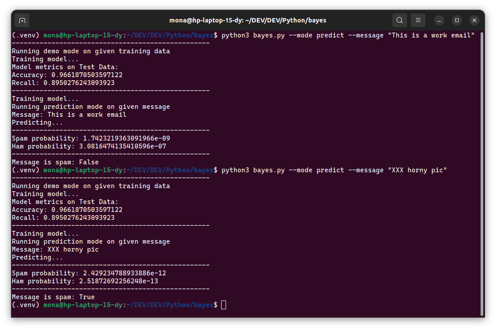

# Naive Bayes Spam Classifier

## Installation and usage

This project was designed and tested with Python 3.10.6. It should work with any Python 3.6+. For testing our project I would recommend creating a virtual environment, for isolating all the needed dependencies. Run the following commands on your terminal:

```bash
python3 -m venv .venv
source .venv/bin/activate
pip install -r requirements.txt
```

After that, you can run the project with the following command:

```bash
python3 bayes.py
```

Running our script with the previous command would use the default values we have set, which are:

- The training dataset is located at `data/sms_spam.csv`
- A smoothing parameter of 0.5 (alpha)
- English stopwords provided by `sklearn`

You can also run `python3 bayes.py --help` to see all the available options.


If you'd like to use the model for predicting a specific message, you can run the following command:

```bash
python3 bayes.py --predict "Your message here"
```

It would produce an output similar to this:


